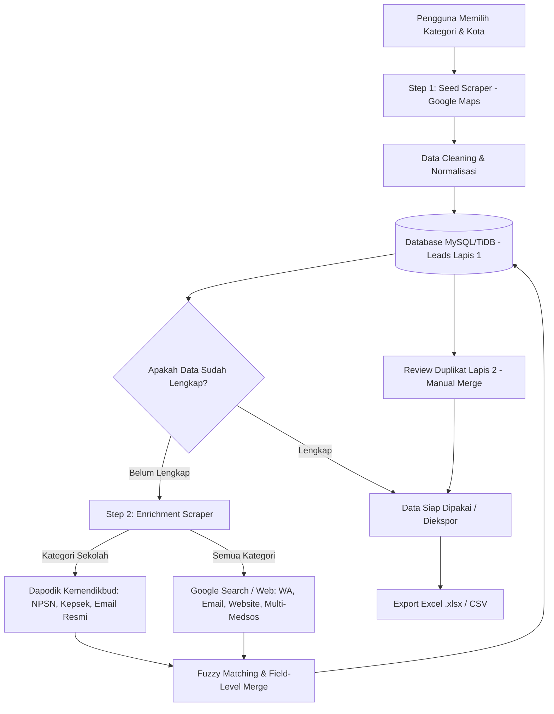

# Web Scraper & B2B Lead Generation Tool — PT Edtekno Inovasi Indonesia

Aplikasi internal berbasis web yang dirancang khusus untuk mengotomatisasi pengumpulan, pembersihan, pengayaan (*enrichment*), deduplikasi, dan ekspor **prospek bisnis (B2B Leads)** dari sumber-sumber publik di Indonesia.

Dibangun dengan arsitektur **FastAPI (MVC)**, database **MySQL (TiDB Cloud)** dengan relasi tabel lookup ternormalisasi, antarmuka **Frontend Web Interaktif (Single Page Application)**, serta otomatisasi browser berbasis **Playwright**.

---

## Daftar Isi
1. [Latar Belakang & Masalah](#-latar-belakang--masalah)
2. [Arsitektur Pipeline Data (Seed → Enrichment)](#-arsitektur-pipeline-data-seed--enrichment)
3. [Fitur Unggulan](#-fitur-unggulan)
4. [Struktur Folder & Pola MVC](#-struktur-folder--pola-mvc)
5. [Prasyarat Sistem](#-prasyarat-sistem)
6. [Panduan Instalasi & Setup](#-panduan-instalasi--setup)
7. [Konfigurasi Environment Variable (.env)](#-konfigurasi-environment-variable-env)
8. [Panduan Menjalankan & Penggunaan](#-panduan-menjalankan--penggunaan)
9. [Dokumentasi API & Pengujian](#-dokumentasi-api--pengujian)
10. [Trio Dokumen Arsitektur](#-trio-dokumen-arsitektur)
11. [Troubleshooting & FAQ](#-troubleshooting--faq)

---

## 🎯 Latar Belakang & Masalah

Proses pengumpulan prospek prospektif (sekolah, kampus, perusahaan corporate, instansi, UMKM, dan vendor) sebelumnya dilakukan secara manual dengan menyalin profil satu per satu dari Google Maps atau direktori publik ke spreadsheet. Proses ini lambat, rentan salah ketik, menghasilkan banyak data duplikat, dan seringkali menghasilkan kontak yang tidak lengkap (misalnya tidak ada NPSN sekolah, tanpa email resmi, atau nomor telepon belum berstandar internasional).

**Tool ini menghadirkan solusi otomatis terpadu:**
- Mengumpulkan ratusan hingga ribuan entitas bisnis secara otomatis dan terukur.
- Memperkaya data kontak yang tidak tersedia di Google Maps melalui pipeline *Enrichment* khusus.
- Membersihkan dan menormalisasi format telepon, email, website, dan nama instansi secara otomatis.
- Mencegah duplikasi data melalui proteksi basis data dua lapis.
- Menyediakan antarmuka visual terpusat yang mudah digunakan oleh tim non-teknis (Sales/Marketing) maupun Data Analyst.

---

## 🔄 Arsitektur Pipeline Data (Seed → Enrichment)

Pipeline data menggunakan pendekatan dua tahap yang efisien dan terarah:



### 1. Tahap 1: Seed Scraping (Google Maps)
- Bertindak sebagai **fondasi daftar prospek** untuk seluruh segmen pasar.
- Mengumpulkan entitas dasar: nama instansi/bisnis, kategori, alamat fisik, kota, koordinat/tautan Google Maps, nomor kontak publik, dan website awal.
- Menggunakan browser headful Playwright dengan profil Chrome lokal untuk menjaga sesi dan menghindari blokir captcha.

### 2. Tahap 2: Lazy Enrichment (Pengayaan Data Bersasaran)
- Dipicu langsung per job seed melalui tombol **⚡ Enrich** pada baris Riwayat Job atau tombol **Detail Data Belum Lengkap**.
- **Sekolah**: Mengambil data dari ekosistem **Dapodik Kemendikbud** (`referensi.data.kemdikbud.go.id`, `sekolah.data.kemdikbud.go.id`) untuk melengkapi **NPSN**, **Nama Kepala Sekolah**, dan **Email Resmi Sekolah**.
- **Corporate, UMKM, Retail, & Vendor**: Mengambil data dari **Pencarian Google / Web (DuckDuckGo)** untuk menemukan nomor WhatsApp, alamat email tambahan, website resmi, serta akun media sosial (**Instagram, Facebook, LinkedIn, Twitter/X, TikTok**).
- **Aturan Penggabungan (*Field-Level Merge*)**: Enrichment hanya mengisi kolom yang masih kosong dan **tidak pernah menimpa** data yang sudah ada sebelumnya.

---

## ⚡ Fitur Unggulan

| Modul Fitur | Penjelasan Detail |
|---|---|
| **🔐 Autentikasi Internal** | Login berbasis sesi (*signed HttpOnly cookie*) dengan hashing sandi `bcrypt`. Mengamankan seluruh endpoint API dari akses publik. |
| **🕷️ Scraping Cerdas & Adaptif** | Scraper Google Maps dengan keyword cerdas per kategori, delay acak (1–3 detik) anti-rate-limit, serta browser profile cloning dari Chrome bawaan. |
| **⚡ Background Job & Watchdog** | Eksekusi scraping berjalan di background thread. Pengguna memantau progres realtime via polling teratur (tiap 3 detik). Dilengkapi sistem *watchdog* untuk memulihkan status job jika proses terputus. |
| **🛑 Tombol Batal & Progress Preservation** | Job scraping/enrichment dapat dibatalkan kapan saja melalui tombol **Stop/Batalkan**. Seluruh data yang telah terambil sebelum pembatalan tetap tersimpan rapi di database. |
| **🧹 Auto Cleaning Engine** | Pembersihan otomatis: standarisasi nomor HP/telepon ke format `628xxxxxxxx`, sanitasi alamat, validasi format email, pembersihan URL website, dan filter domain junk/sampah. |
| **🏷️ Business Code Generator** | Pembuatan ID bisnis unik berformat standar industri: Prospek (`LD-{KATEGORI}-{001}`), Kategori (`KAT-{KATEGORI}-{001}`), dan Kota (`K-{KOTA}-{001}`). |
| **🛡️ Anti-Duplikat 2 Lapis** | **Lapis 1 (Otomatis)**: Unique constraint basis data `(source, nama_instansi, city_id)` dengan mekanisme *upsert* cerdas.<br>**Lapis 2 (Review Manual)**: Algoritma fingerprinting untuk mendeteksi kesamaan nama fuzzy, nomor telepon, email, domain website, atau NPSN dengan antarmuka komparasi side-by-side. |
| **🔍 Penanganan Data Belum Lengkap** | Modal investigasi khusus untuk melihat lead mana saja yang gagal ter-enrich atau belum memiliki kontak, disertai tombol aksi langsung untuk enrichment ulang dengan sumber alternatif. |
| **📊 Ekspor Excel Profesional** | Menghasilkan file `.xlsx` dengan pewarnaan tema hijau Edtekno, auto-fit lebar kolom, format teks rapi (mencegah angka `0` hilang di nomor HP), dan data validation dropdown status prospek. |
| **📥 Impor & Ekspor Kontingensi** | Fasilitas ekspor & impor CSV multipart jika scraping langsung terhambat atau untuk migrasi data eksternal. |

---

## 📂 Struktur Folder & Pola MVC

Proyek ini menerapkan pemisahan tanggung jawab yang ketat mengikuti pola **Model-View-Controller (MVC)**:

```
Web_Scraper/
├── backend/
│   ├── main.py                     # Entry point FastAPI, lifespan, mount router & frontend
│   ├── config.py                   # Konfigurasi aplikasi dari environment variable (.env)
│   ├── deps.py                     # Dependency injection untuk validasi sesi auth
│   ├── seed.py                     # Inisialisasi akun administrator awal
│   ├── models/                     # [MVC: MODEL] Definisi tabel SQLAlchemy
│   │   ├── base.py                 # Engine database, SessionLocal, SSL config TiDB
│   │   ├── user.py                 # Tabel users
│   │   ├── category.py             # Tabel categories (lookup kategori ternormalisasi)
│   │   ├── city.py                 # Tabel cities (lookup kota ternormalisasi)
│   │   ├── lead.py                 # Tabel leads (prospek utama + multi-medsos + unique constraint)
│   │   ├── scrape_job.py           # Tabel scrape_jobs (pelacakan status & progres job)
│   │   └── merge_history.py        # Tabel merge_history (riwayat penggabungan duplikat)
│   ├── controllers/                # [MVC: CONTROLLER] Route handler & endpoint API
│   │   ├── auth_routes.py          # /api/auth/login, /api/auth/logout, /api/auth/me
│   │   ├── scrape_routes.py        # /api/scrape, /api/enrich, /api/jobs, /api/sources
│   │   └── lead_routes.py          # /api/leads, /api/stats, /api/export, /api/duplicates
│   ├── services/                   # [MVC: BUSINESS LOGIC] Logika bisnis & pengolahan data
│   │   ├── auth_service.py         # Verifikasi & hashing password bcrypt
│   │   ├── cleaner.py              # Normalisasi telepon (628), nama, website, email
│   │   ├── code_generator.py       # Pembuat kode bisnis terstruktur (LD-, KAT-, K-)
│   │   ├── storage_service.py      # Operasi database, upsert, query leads, & job tracking
│   │   ├── job_manager.py          # Thread runner, status job, cancelation, & watchdog
│   │   ├── enrichment_service.py   # Fuzzy matching & field-level merging
│   │   ├── dedup_service.py        # Algoritma pencarian duplikat & resolusi merge
│   │   ├── exporter.py             # Generator Excel profesional (.xlsx) & CSV
│   │   ├── importer.py             # Parser impor data CSV
│   │   └── scrapers/               # Mesin pengumpul data publik
│   │       ├── base.py             # BaseScraper: rate limit 1-3 detik, cancel signal
│   │       ├── gmaps.py            # Playwright Google Maps Scraper (Seed)
│   │       ├── dapodik.py          # Scraper detail Dapodik Kemendikbud
│   │       └── google.py           # Scraper pencarian kontak Google / DuckDuckGo
│   └── audio/                      # Aset efek audio untuk interaksi UI frontend
├── frontend/                       # [MVC: VIEW] Antarmuka Single Page Application
│   ├── index.html                  # Struktur halaman (Login, Dashboard, Scrape, Leads, Review)
│   ├── app.js                      # Interaksi frontend, render tabel, polling status job
│   └── style.css                   # Desain visual bernuansa hijau profesional Edtekno
├── tools/                          # Utilitas administratif, migrasi skrip, & validator
│   ├── check_docs_sync.py          # Validator sinkronisasi prd.md, file.md, database.md
│   └── migrate_*.py                # Skrip migrasi DDL database
├── tests/                          # Automated unit & integration tests (pytest)
├── prd.md                          # Dokumen PRD v1.1 (Kebutuhan & SOP Bisnis)
├── file.md                         # Peta Modul & Alur Pemanggilan Kode (Call Graph)
├── database.md                     # Skema Detail Tabel, Relasi, Kolom, & Enum
├── requirements.txt                # Dependensi produksi Python
├── requirements-dev.txt            # Dependensi pengujian & pengembangan
└── run.py                          # Skrip untuk menyalakan server lokal
```

---

## 💻 Prasyarat Sistem

Sebelum menginstal proyek, pastikan perangkat telah terpasang:
- **Python 3.10** atau versi yang lebih baru (disarankan 3.11 atau 3.12).
- **Google Chrome** (untuk pemanfaatan profil login browser pada scraper Playwright).
- **Koneksi Internet** aktif untuk mengakses database cloud dan sumber data scraping.
- **Akun Database TiDB Cloud / MySQL Server**.

---

## 🚀 Panduan Instalasi & Setup

Ikuti langkah-langkah berikut secara berurutan:

### 1. Buat dan Aktifkan Virtual Environment
Buka terminal pada direktori root proyek:

**Windows (PowerShell / Command Prompt):**
```powershell
python -m venv venv
.\venv\Scripts\activate
```

**macOS / Linux:**
```bash
python3 -m venv venv
source venv/bin/activate
```

### 2. Pasang Dependensi Python
Pasang paket dependensi utama dan pengujian:
```bash
pip install -r requirements.txt
pip install -r requirements-dev.txt
```

### 3. Pasang Driver Browser Playwright
Aplikasi membutuhkan mesin browser Chromium untuk melakukan scraping Google Maps dan Dapodik:
```bash
playwright install chromium
```

---

## ⚙️ Konfigurasi Environment Variable (.env)

Salin file contoh konfigurasi `.env.example` menjadi file `.env`:

**Windows:**
```powershell
copy .env.example .env
```

**macOS / Linux:**
```bash
cp .env.example .env
```

Buka file `.env` yang baru dibuat dan sesuaikan pengaturannya:

```ini
# ============================================================
#  Konfigurasi Basis Data (TiDB Cloud / MySQL)
# ============================================================
DB_HOST=your_database_host
DB_PORT=4000
DB_USER=your_database_user
DB_PASSWORD=your_database_password
DB_NAME=your_database_name

# Pengaturan SSL (aktifkan jika menggunakan cloud database seperti TiDB Cloud)
DB_SSL_CA=
DB_SSL_VERIFY=true

# ============================================================
#  Sesi Aplikasi & Keamanan
# ============================================================
SESSION_SECRET=your_random_secret_key
APP_HOST=127.0.0.1
APP_PORT=8000

# ============================================================
#  Akun Administrator Awal (Diinisialisasi saat pertama kali dijalankan)
# ============================================================
SEED_USERNAME=your_admin_username
SEED_PASSWORD=your_admin_password
SEED_FULL_NAME="System Administrator"

# ============================================================
#  Parameter Pengaturan Scraper
# ============================================================
SCRAPER_MIN_DELAY=1
SCRAPER_MAX_DELAY=3
SCRAPER_DEFAULT_MAX_RESULTS=100
```

> ⚠️ **PERHATIAN KEAMANAN**: Jangan pernah menambahkan atau meng-commit file `.env` berisi kredensial asli ke repositori Git. File `.env` telah didaftarkan dalam `.gitignore`.

---

## 🖥️ Panduan Menjalankan & Penggunaan

### 1. Menjalankan Server Aplikasi
Jalankan server aplikasi lokal:
```bash
python run.py
```
Aplikasi akan aktif dan dapat diakses melalui browser pada alamat:
👉 **`http://127.0.0.1:8000`**

### 2. Alur Penggunaan Aplikasi

#### A. Masuk ke Aplikasi
- Buka `http://127.0.0.1:8000` di peramban web.
- Masukkan kredensial login akun administrator sesuai nilai yang Anda tentukan pada parameter `SEED_USERNAME` dan `SEED_PASSWORD` di file `.env` lokal Anda.

#### B. Melakukan Scraping Baru (Seed)
1. Buka menu navigasi **Mulai Scraping**.
2. Pilih sumber: **Google Maps** (sebagai sumber seed utama).
3. Pilih Kategori Target (misal: *Sekolah*, *Kafe/Resto*, *UMKM/Toko*, *Retail*, *Jasa*, atau masukkan custom keyword).
4. Masukkan Kota Target (misal: *Semarang*, *Salatiga*, *Solo*).
5. Tentukan Batas Maksimal Hasil (misal: *50* atau *100*).
6. Klik **Mulai Scraping**.
7. Anda akan melihat jendela progres secara realtime. Anda dapat menghentikan proses kapan saja menggunakan tombol **Batalkan / Stop**.

#### C. Menjalankan Pengayaan Data (Enrichment)
1. Pada tabel **Riwayat Job**, temukan baris job Google Maps yang telah selesai.
2. Klik tombol **⚡ Enrich** pada baris job tersebut.
3. Sistem otomatis menjalankan scraper pendukung (Dapodik untuk Sekolah, atau Google Search untuk entitas umum) secara *lazy* untuk mengisi kontak yang masih kosong.
4. Jika ingin memeriksa rincian data mana saja yang belum memiliki email, website, atau telepon lengkap, klik tombol **Detail Data Belum Lengkap** pada kartu job.

#### D. Meninjau & Menggabungkan Duplikat
1. Buka menu **Review Duplikat**.
2. Sistem akan menampilkan kelompok data yang terdeteksi memiliki kemiripan nama, nomor telepon, email, domain, atau NPSN yang identik.
3. Anda dapat memilih aksi:
   - **Pertahankan A** atau **Pertahankan B**.
   - **Gabungkan (Merge)**: Memilih secara fleksibel atribut mana (telepon, email, alamat) yang ingin disimpan dari masing-masing sumber.
   - **Hapus Semua**.

#### E. Mengelola & Mengekspor Prospek
1. Buka menu **Daftar Leads**.
2. Gunakan kolom pencarian dan filter dropdown (Kota, Kategori, Sumber, dan Status Prospek: *New*, *Contacted*, *Follow Up*, *Deal*, *Rejected*).
3. Klik tombol **Export Excel (.xlsx)** untuk mengunduh berkas laporan siap pakai untuk tim Sales & Marketing.

---

## 🧪 Dokumentasi API & Pengujian

### 1. Dokumentasi Interaktif OpenAPI (Swagger & ReDoc)
Aplikasi FastAPI menyediakan dokumentasi interaktif secara bawaan:
- **Swagger UI**: `http://127.0.0.1:8000/docs`
- **ReDoc**: `http://127.0.0.1:8000/redoc`

Seluruh endpoint privat membutuhkan cookie sesi aktif (`session`).

### 2. Menjalankan Pengujian Otomatis (Unit Tests)
Jalankan rangkaian pengujian otomatis menggunakan `pytest`:
```bash
venv\Scripts\python.exe -m pytest tests/ -v
```

Cakupan pengujian mencakup:
- `test_auth.py`: Uji login, proteksi rute, dan invalidasi sesi.
- `test_codes_and_socials.py`: Uji format kode bisnis unik dan penyimpanan multi-sosmed.
- `test_enrichment_core.py`: Uji logika penggabungan data non-destruktif (*non-replacing*), *preservation progress*, dan penghapusan relasi cascade.
- `test_google_enrichment.py`: Uji parsing dan enrichment kontak via pencarian web.
- `test_browser_profile_and_progress.py`: Uji cloning profil browser lokal dan isolasi direktori scraper.

### 3. Validasi Sinkronisasi Dokumentasi
Proyek memiliki skrip validator otomatis untuk menjamin kode dan dokumentasi selalu selaras:
```bash
venv\Scripts\python.exe tools\check_docs_sync.py
```

---

## 📚 Trio Dokumen Arsitektur

Bagi pengembang maupun asisten AI yang hendak memodifikasi kode sumber, wajib memahami bahwa repositori ini dikelola oleh tiga pilar dokumentasi yang saling terhubung:

| Berkas Dokumen | Fokus Utama | Pertanyaan yang Dijawab |
|---|---|---|
| **[prd.md](prd.md)** | Product Requirement Document (Bisnis & SOP) | **APA** yang dibangun dan **MENGAPA** dibangun? |
| **[file.md](file.md)** | Code Map, Pohon Folder, & Call Graph | **DIMANA** letak modulnya dan **BAGAIMANA** alur kodenya berjalan? |
| **[database.md](database.md)** | Skema Database, Relasi, Enum, & Unique Key | **DATA** apa saja yang disimpan dan bagaimana relasinya? |

Setiap penambahan modul baru atau perubahan skema data wajib diikuti dengan memperbarui dokumen terkait dan memvalidasinya menggunakan `tools/check_docs_sync.py`.

---

## 🔧 Troubleshooting & FAQ

#### 1. Muncul pesan `OperationalError: (2003, "Can't connect to MySQL server...")`
- Periksa kredensial database pada `.env`.
- Pastikan koneksi internet stabil.
- TiDB Cloud memerlukan pengaturan SSL. Pastikan parameter `DB_SSL_VERIFY=true` telah disetel pada `.env`.

#### 2. Scraper Playwright gagal dijalankan (`Executable doesn't exist`)
- Jalankan perintah berikut untuk mengunduh biner Chromium yang dibutuhkan:
  ```bash
  playwright install chromium
  ```

#### 3. Tampilan browser scraper muncul saat scraping berlangsung
- Secara default, scraper Google Maps dan Dapodik dijalankan secara *headful* (jendela browser terlihat) untuk meminimalisasi deteksi bot oleh platform Google. Jangan menutup jendela browser tersebut secara manual agar proses scraping tidak terinterupsi. Jika ingin membatalkan, selalu gunakan tombol **Stop/Batalkan** pada antarmuka web aplikasi.

#### 4. Job berstatus `running` tetapi browser sudah tidak merespons
- Sistem memiliki fitur *watchdog reconciler*. Pada saat Anda membuka kembali halaman aplikasi atau memuat ulang riwayat job, sistem akan secara otomatis mendeteksi job yang terputus (stalled >600 detik atau proses background mati) dan mengubah statusnya menjadi `error` secara aman tanpa merusak database.

---
